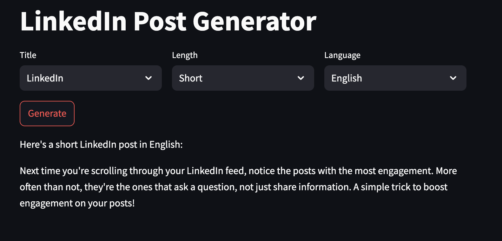
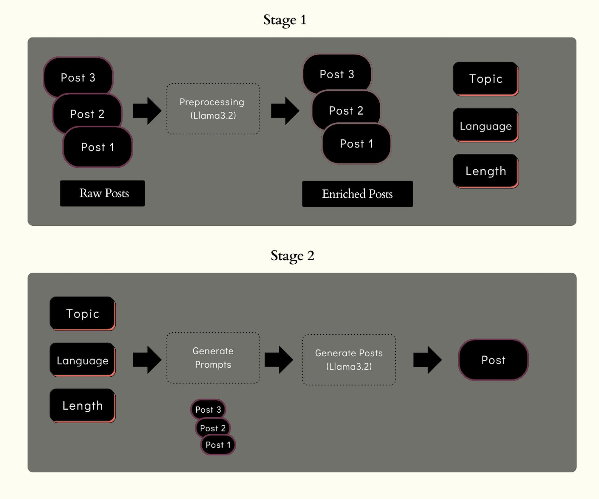

# Linkedin_Post_Generator
This innovative tool helps LinkedIn influencers analyze their past posts and generate new ones that align with their unique writing style. 



Imagine Alex, a LinkedIn influencer, who wants assistance crafting posts that resonate with his audience. By feeding his previous LinkedIn posts into this tool, it extracts essential details like key topics, writing tone, post length, and more. Alex can then select parameters like topic, language, and length, and use the "Generate" button to create a new post that seamlessly matches his established style.

## Technical Architecture


1. Stage 1: The tool collects LinkedIn posts and analyzes them to extract key characteristics such as topics, language preferences, and post length.
2. Stage 2: Using the selected topic, language, and length, it generates a new post. The tool leverages few-shot learning by referencing past posts on similar topics to guide the LLM (Large Language Model) in replicating the user's writing style.

## Set-up
1. To get started we first need to get an API_KEY from here: https://console.groq.com/keys. Inside `.env` update the value of `GROQ_API_KEY` with the API_KEY you created. 
2. To get started, first install the dependencies using:
    ```commandline
     pip install -r requirements.txt
    ```
3. Run the streamlit app:
   ```commandline
   streamlit run main.py
   ```
This tool not only simplifies the process of content creation but also ensures that influencers maintain consistency in their voice and tone, helping them engage better with their audience. Perfect for those who want to save time while maximizing impact on LinkedIn!